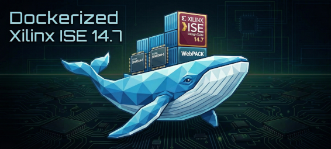

# Dockerized Xilinx ISE 14.7 (CLI)

<div align="center">
  
  <br/>
  
  
  

  <p>
    <b>A lightweight, headless Docker container for Xilinx ISE 14.7</b>
  </p>
</div>

## **Description**
**Spin up and run a Xilinx ISE 14.7 installation anywhere within minutes!**

**(+ OSS CAD Suite comes bundled)**

This project aims to solve the absolute headache of installing legacy Xilinx tools on modern Linux distributions (Ubuntu 22.04+, Fedora, Arch, etc.). It encapsulates all the necessary 32-bit libraries and environment configurations required to run `xtclsh`, `xst`, `ngdbuild`, and `bitgen` without crashing.

**Note:** This container is designed for **Command Line (CLI) usage only**. It is ideal for CI/CD pipelines, automated builds, and Makefile-based workflows. It does not support the ISE GUI (Project Navigator).

## **Prerequisites**
Due to Xilinx licensing limits, you have to download the ISE installer yourself and place it in the `Resources/` directory.

You can download the Xilinx ISE Design Suite- 14.7 here:

https://www.xilinx.com/member/forms/download/xef.html?filename=Xilinx_ISE_DS_Lin_14.7_1015_1.tar

(if link above fails: https://www.xilinx.com/support/download/index.html/content/xilinx/en/downloadNav/vivado-design-tools/archive-ise.html You need the one labeled "**Full Installer for Linux**")

**Note:** Ensure the file is named `Xilinx_ISE_DS_Lin_14.7_1015_1.tar` and is placed inside the `Resources/` directory.

## **Installation / Build**

1) Clone this repo:

```Bash
git clone https://github.com/I-A-S/Docked-ISE-147
cd Docked-ISE-147
```

2) Download and place the `Xilinx_ISE_DS_Lin_14.7_1015_1.tar` tarball inside the `Resources/` folder

3) Build the Docker image:

```Bash
docker build -t docked-ise-147 .
```

## **Usage**

1) Verify the installation:

```Bash
docker run --rm docked-ise-147 xtclsh -h
```

2) Interactive shell:

```Bash
docker run --rm -it -v "$(pwd):/workspace" docked-ise-147 bash
```

*(Note: On Windows PowerShell, use "\${PWD}" instead of "$(pwd)")*

## **Licensing**
This container installs the ISE WebPACK edition by default (You can check `Resources/install.sh` for customizing this!).

If your project requires a specific license file (Xilinx.lic), you can mount it into the container like so:

```Bash
docker run --rm \
  -v $(pwd):/workspace \
  -v /path/to/your/Xilinx.lic:/root/.Xilinx/Xilinx.lic \
  docked-ise-147 \
  make
```

(Alternatively, set the XILINXD_LICENSE_FILE env var with -e flag).

## **License**

This project is licensed under the Apache License Version 2.0.

<hr>

<p align="left"> <i>Logo generated with Google Gemini (Nano Banana Pro)</i> </p>
